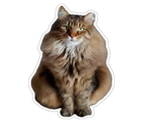

# catscan

`catscan` is a toy R package developed for the PHAC/HC R User Group
Lunch & Learn on developing custom R packages. Includes functions and
data to mimic reporting of health product complaint data, but in the
context of fictional cat observations in greater Toronto area. Any
resemblance to actual cats (living or dead) or actual events is purely
coincidental.

<figure>

<figcaption aria-hidden="true">“Meow!” ~ Mr Jones</figcaption>
</figure>

## Installation

You can install the latest version of catscan from
<https://github.com/jennyrieck/catscan> with:

``` r
## Install via devtools (depracated in devtools 2.5.0)
# devtools::install_git("jennyrieck/catscan", build_vignettes = TRUE) 

## Install via pak (preferred)
# install.packages("pak")

## Set global option for your current R session to build vignettes
options(pkg.build_vignettes = TRUE)

## Make sure knitr and rmarkdown are installed to build vignettes
# install.packages(c("knitr", "rmarkdown"))

pak::pak("jennyrieck/catscan")
```

## Example

See the `catscan` vignette `cat-search-template` for a step-by-step
tutorial on how to conduct a text search of the `cat_observations` data
set.

``` r
library(catscan)
browseVignettes("catscan")
```

## Presentation

The presentation from the PHAC/HC R User Group Lunch & Learn can be
found here: [Packaging youR code: a beginner’s guide to R package
development](https://github.com/jennyrieck/catscan/blob/main/Packaging%20youR%20code.pdf)
